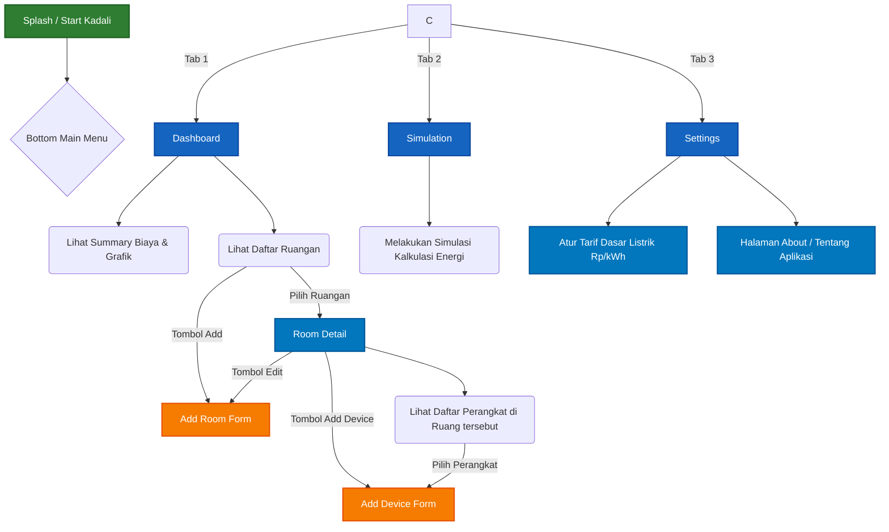

# Dokumen Deskripsi & Flow Aplikasi Kadali

## 1. Apa itu Aplikasi Kadali?

**Kadali** adalah sebuah sistem aplikasi pintar untuk analisis dan manajemen penggunaan energi listrik yang dirancang khusus untuk lingkungan perkantoran maupun residensial. Aplikasi ini memiliki pendekatan "Data-First" yang bertujuan untuk memonitor, menganalisis, dan mengoptimalkan konsumsi listrik dengan cara mengkalkulasi estimasi biaya operasional berdasarkan beban daya (Watt) perangkat dan durasi pemakaian nyata setiap harinya.

Kadali dibangun dengan arsitektur **Cloud-First** menggunakan Firebase Firestore, yang menjamin data selalu sinkron secara otomatis dan *real-time* di seluruh perangkat yang terhubung, namun tetap dapat berfungsi ketika *offline* (Offline Resilience).

---

## 2. Fitur-Fitur Utama

Berikut adalah fitur kapabilitas utama yang terdapat dalam aplikasi Kadali:

*   **📊 Dashboard Analitik Real-time**
    *   Kalkulasi otomatis secara instan untuk estimasi pengeluaran biaya listrik (Harian, Bulanan, dan Tahunan).
    *   Visualisasi distribusi penggunaan energi melalui grafik (Bar Chart) untuk mengetahui area mana yang paling boros energi.
*   **🏢 Manajemen Ruangan (Room Management)**
    *   Membuat dan mengelompokkan area pengawasan berdasarkan ruangan (contoh: "Ruang Server", "Ruang Meeting", "Kantin").
    *   Ubah dan kelola detail ruangan kapan saja.
*   **🔌 Inventaris Perangkat (Device Inventory)**
    *   Mendata setiap perangkat elektronik yang ada di masing-masing ruangan.
    *   Setiap perangkat menyimpan detail metrik seperti: Rating daya (Watt), jumlah unit perangkat (Quantity), dan rata-rata durasi penggunaan per hari (Hours/Day).
*   **🧮 Simulasi (Simulation)**
    *   Halaman khusus untuk melakukan uji coba simulasi atau perhitungan teknis untuk efisiensi energi.
*   **⚙️ Konfigurasi Tarif Listrik (Settings & Tariff)**
    *   Kemampuan untuk menyesuaikan harga tarif dasar listrik (Rp/kWh) sesuai dengan regulasi PLN / utilitas lokal yang berlaku saat ini.

---

## 3. Diagram Flow Aplikasi

Berikut adalah gambaran teknis dari alur navigasi dan interaksi pengguna (User Flow) dalam aplikasi Kadali.

### Penjelasan Flow Navigasi:
1. **Mulai & Splash:** Ketika pengguna pertama kali membuka aplikasi, akan dimuat **Splash Screen** sebelum masuk ke struktur navigasi utama.
2. **Bottom Navigation (Menu Bawah):** Pengguna dihadapkan pada 3 menu utama, yaitu *Dashboard*, *Simulation*, dan *Settings*.
3. **Flow Dashboard (Inti Aplikasi):**
   - Pengguna dapat melihat **grafik dan ringkasan biaya** pada menu ini.
   - Pengguna bisa menambah ruangan baru secara langsung (*Add Room*).
   - Pengguna dapat menekan salah satu ruangan untuk masuk ke **Room Detail**.
4. **Flow Room Detail (Manajemen Perangkat):**
   - Di dalam *Room Detail*, pengguna dapat mengedit nama ruangan tersebut atau melihat seluruh daftar perangkat elektronik di dalamnya.
   - Pengguna dapat menambah perangkat baru (*Add Device*) dengan mengisi Watt, Jumlah, dan Jam pemakaian, atau mengedit perangkat yang sudah ada dengan memilihnya di daftar penyajian.
5. **Flow Settings:**
   - Pengguna diharuskan/biasa masuk ke sini untuk memperbarui nominal tarif listrik (Rp/kWh) agar kalkulasi *Dashboard* tetap akurat. Pengguna juga dapat membaca info *About* terkait aplikasi.
