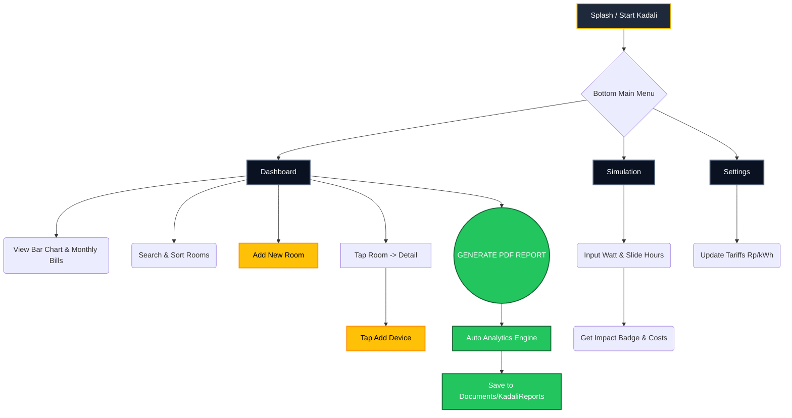

# 📘 KADALI: Smart Energy Management System
**Dokumen Penawaran Produk & Spesifikasi Teknis Lengkap**

---

## 1. Executive Summary (Ringkasan Eksekutif)
**Kadali** adalah sebuah sistem aplikasi cerdas modern yang dirancang untuk melakukan pemantauan, analisis, dan simulasi penggunaan energi listrik (Electrical Usage Analysis System). Aplikasi ini diciptakan khusus untuk membantu manajemen perkantoran (Office), pabrik, atau residensial dalam mengontrol biaya operasional listrik melalui pendekatan **"Data-First"** dan **Analytical Reporting**.

Berbeda dengan aplikasi pencatat biasa, Kadali bertindak sebagai "Auditor Energi Digital" yang tidak hanya mencatat daya, tetapi secara otomatis memproyeksikan biaya ke depan (Cost Projection), mengklasifikasikan beban (Load Classification), dan bahkan memberikan **Rekomendasi Efisiensi Dinamis** secara otomatis yang di-generate ke dalam Laporan PDF Profesional.

---

## 2. Nilai Jual Utama (Unique Selling Propositions - USP)

Mengapa aplikasi Kadali sangat bernilai untuk dijual atau diimplementasikan?

1. **Penghematan Biaya Terukur (Cost Optimization):** Memberikan transparansi mutlak ke sistem kelistrikan. Pengguna bisa tahu pasti ruangan/perangkat mana yang paling boros dan mengambil tindakan pencegahan.
2. **Generasi Laporan PDF Profesional (12-Section PDF):** Sistem secara otomatis membuat naskah audit energi yang sangat detail. Sempurna untuk diserahkan ke manajemen/C-Level sebagai pertanggungjawaban operasional bulanan.
3. **Simulasi "What-If" Instan:** Fitur kalkulator simulasi sebelum perusahaan memutuskan membeli alat elektronik baru (contoh: "Jika beli AC 2000W dan nyala 10 jam, berapa biaya tambahannya bulan ini?").
4. **Cloud-First & Real-time:** Berbasis Firebase Firestore. Jika diinstal di banyak tablet/HP staf gedung, data saling tersinkronisasi dalam hitungan milidetik secara realtime, serta mampu bekerja secara *offline* (Offline Resilience).

---

## 3. Fitur Utama & Fungsionalitas Lengkap

### 📊 A. Dashboard Analitik Real-Time
Pusat kontrol energi Anda dalam satu layar.
*   **Total Monthly Cost:** Kalkulasi instan total estimasi tagihan listrik bulan ini (dalam mata uang Rupiah).
*   **Energy Distribution Chart:** Grafik Interaktif (Bar Chart) yang mengelompokkan secara visual penggunaan energi (kWh/hari) berdasarkan seluruh data ruangan.
*   **Smart Room List:** Daftar seluruh ruangan yang dipantau yang dilengkapi fitur pencarian pintar (*Live Search*) dan pengurutan cerdas (*Newest / Oldest*).

### 🏢 B. Manajemen Ruangan & Inventaris Perangkat (Room & Device Management)
Pendataan terstruktur dengan hirarki.
*   **Tree Structure Tracking:** Setiap perangkat diikat kuat ke ruangan tertentu (Misal: *Gedung A -> Ruang Server -> AC Daikin 2 PK*).
*   **Detailed Metrics Requirement:** Sistem mencatat secara detail: Varian Nama, Rating Daya Kelistrikan (Watt), Jumlah Unit (Qty), dan Estimasi Jam Nyala per Hari.

### 🧮 C. Live Simulation Engine (Simulasi Beban Kelistrikan)
Fitur interaktif untuk engineer atau staf keuangan.
*   **Slider Interaktif (0-24 Jam):** Pengguna menggeser slider durasi, sistem otomatis mengeluarkan hasil kalkulasi Biaya Harian, Bulanan, dan Tahunan.
*   **Dynamic Impact Badge:** Mengkategorikan secara visual apakah spek perangkat tersebut masuk ke "HIGH IMPACT" (Sangat Berpengaruh ke Tagihan) atau "LOW IMPACT".

### 📈 D. Laporan Analisis PDF 12-Bagian (Engine Audit Internal)
*Ini adalah fitur paling "Enterprise" dari Kadali. Menghasilkan laporan berstandar Engineering.*
Isi dari Dokumen Laporan PDF meliputi:
1.  **Cover & Report Info:** Waktu *generate*, periode, total ruangan & perangkat.
2.  **Tariff Configuration:** Harga acuan Rp/kWh saat laporan ini ditarik.
3.  **Overall Energy Summary:** Ringkasan Biaya Harian hingga Tahunan.
4.  **Office Room Directory:** Tabel distribusi beban per ruangan.
5.  **Device Inventory Per Room:** Detail rinci tabel peralatan.
6.  **Top 5 Highest Energy Devices:** Melacak 5 "Vampir Energi" terbesar di seluruh gedung.
7.  **Highest Energy Consumption Room:** Ruangan paling boros energi.
8.  **Technical Device Analysis:** Break-down "Connected Load" (Total Daya Tersambung) per perangkat.
9.  **Load Classification:** Mengelompokkan perangkat. (Low <200W, Medium 200-800W, High 800-2000W, Critical >2000W).
10. **⚡ Dynamic Energy Recommendations:** *Sistem secara otomatis memberikan rekomendasi teks pintar berdasarkan data.* (Contoh: *"Ditemukan 3 perangkat Critical Load >2000W di ruang Server, evaluasi jam pemakaian."* atau *"Ada 5 perangkat menyala 24 Jam non-stop, pertimbangkan penggunaan timer otomatis."*).
11. **Interpretation & Disclaimer:** Standar profesional dokumen.

### ⚙️ E. Konfigurasi Tarif Fleksibel
Memungkinkan penyesuaian perhitungan biaya karena tarif listrik Perusahaan (Golongan Bisnis) dan Perumahan berbeda-beda.

---

## 4. Alur Interaksi Pengguna (User Flow)

Berikut adalah *user journey* ketika menggunakan aplikasi Kadali:



---

## 5. Keunggulan Teknologi (Tech-Stack Spesification)

Sebagai nilai jual kepada instansi (B2B), arsitektur Kadali dibangun dengan teknologi Android Native modern paling mutakhir:
*   **Bahasa Pemrograman:** 100% Kotlin (Modern, Type-Safe, Fast).
*   **Arsitektur Software:** MVVM (Model-View-ViewModel) + Clean Architecture Paradigm untuk skalabilitas bisnis yang mudah dikembangkan.
*   **Database Engine:** Firebase Cloud Firestore (NoSQL, Realtime Sync, Secured, Offline Ready).
*   **UI/UX Design:** Menggunakan "Electric Dark Theme" yang premium dan elemen Material 3 terbaru untuk kenyamanan mata pengguna profesional industri.
*   **PDF Engine:** *Custom Native Android Canvas rendering* untuk meng-generate dokumen yang *pixel-perfect* tanpa *library* berbayar pihak ketiga.
*   **Asynchronous Flow:** Menggunakan teknologi *Kotlin Coroutines & Flow* yang menjadikannya sangat cepat, bebas nge-lag (Anti-ANR / Application Not Responding).

---

## 6. Target Pasar (Market Potensial untuk Dijual)
Aplikasi ini sangat cocok ditawarkan/dijual kepada:
1.  **Building Management / Pengelola Gedung:** Untuk melacak aset kelistrikan penyewa/tenant gedung.
2.  **Facility Management (HRGA Perusahaan):** Mengaudit biaya listrik per divisi atau lantai kantor.
3.  **Rumah Sakit / Pabrik Skala Menengah:** Memonitor beban kelistrikan alat medis & manufaktur.
4.  **Smart Home Enthusiast:** Pemilik rumah menengah ke atas yang sadar akan pentingnya *Energy Cost Control*.

---

## 7. Diagram Relasi Entitas (Entity-Relationship Diagram / ERD)

Aplikasi Kadali menggunakan arsitektur *NoSQL* (Firebase Firestore). Secara konseptual, struktur data dan relasinya dapat digambarkan dalam ERD berikut:

```mermaid
erDiagram
    ROOM {
        string id PK Document ID
        string name Nama Ruangan
        string description Deskripsi (Opsional)
        long createdAt Timestamp Pembuatan
    }
    
    DEVICE {
        string id PK Document ID
        string roomId FK ID Ruangan (Reference)
        string name Nama Perangkat
        double powerWatt Daya Listrik (Watt)
        double usageHoursPerDay Lama Pemakaian (Jam/Hari)
        int quantity Jumlah Perangkat
    }

    TARIFF {
        int id PK Singleton ID (Selalu 1)
        double pricePerKwh Harga per kWh (Rp)
    }

    ROOM ||--o{ DEVICE : memiliki
```

### Penjelasan Struktur Data (Firestore Collections)
*   **`rooms` Collection:** Menyimpan definisi ruangan.
*   **`devices` Collection:** Menyimpan data peralatan elektronik. Setiap *device* memiliki atribut `roomId` yang merujuk pada `rooms` tertentu. (Relasi *One-to-Many*).
*   **`config/global` Document (Tariff):** Merupakan dokumen bernilai tunggal (*Singleton*) yang menyimpan harga per kWh secara global. Semua perhitungan kalkulasi harga bergantung pada nilai di dokumen ini.
