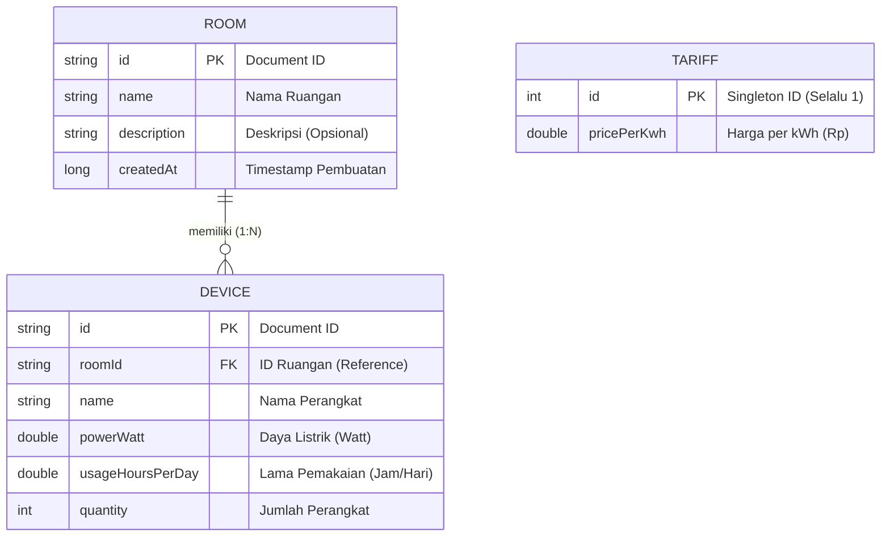

# Kadali Application Diagrams

Here are the raw Mermaid codes for the Application Flow Chart and Entity-Relationship Diagram (ERD). You can copy these and paste them directly into Mermaid Live Editor (https://mermaid.live/), Notion, GitHub README, or any other Markdown viewer that supports Mermaid.

### 1. Application User Flow Chart

```mermaid
graph TD
    %% Styling
    classDef start fill:#1E293B,stroke:#FFC107,stroke-width:2px,color:#fff;
    classDef core fill:#0A1221,stroke:#64748B,stroke-width:2px,color:#fff;
    classDef action fill:#FFC107,stroke:#FF8F00,stroke-width:2px,color:#000;
    classDef report fill:#22C55E,stroke:#166534,stroke-width:2px,color:#fff;

    A["Splash / Start Kadali"] --> B{"Bottom Main Menu"}
    class A start;

    B --> C["Dashboard"]
    B --> D["Simulation"]
    B --> E["Settings"]
    class C,D,E core;

    %% Dashboard Flow
    C --> C1("View Bar Chart & Monthly Bills")
    C --> C2("Search & Sort Rooms")
    C --> C3["Add New Room"]
    class C3 action;

    C --> C4["Tap Room -> Detail"]
    C4 --> C5["Tap Add Device"]
    class C5 action;

    %% Settings
    E --> E1("Update Tariffs Rp/kWh")

    %% Simulation
    D --> D1("Input Watt & Slide Hours")
    D1 --> D2("Get Impact Badge & Costs")

    %% PDF Flow
    C --> F(( "GENERATE PDF REPORT" ))
    F --> F1["Auto Analytics Engine"]
    F1 --> F2["Save to Documents/KadaliReports"]
    class F,F1,F2 report;
```

---

### 2. Entity-Relationship Diagram (ERD)


